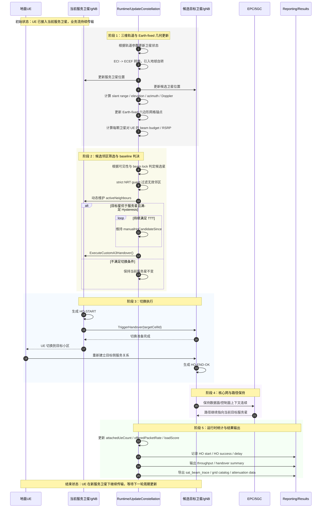
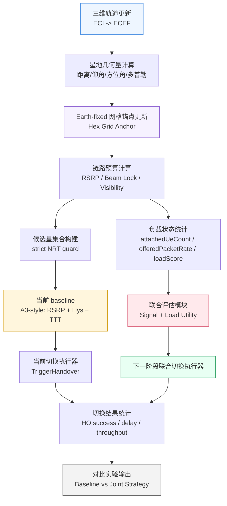

# 毕设中期汇报流程图

这份文件给出两张适合中期汇报展示的流程图：

- 图 1：当前 `baseline` 的切换时序图
- 图 2：下一阶段“信号质量 + 卫星负载”联合策略的接入流程图

建议：

- 如果你的 Markdown 预览支持 `Mermaid`，可以直接查看渲染效果。
- 如果答辩 PPT 不方便直接嵌入 `Mermaid`，可以先截图，再放进幻灯片。

---

## 图 1：当前 LEO-NTN baseline 切换时序图

这张图对应当前平台的真实状态，重点体现：

- 三维轨道更新与 `ECI -> ECEF`
- `Earth-fixed` 地面六边形网格锚点
- `25 UE` 的热点增加 + 边界增强二维部署
- `strict NRT guard`
- 自定义 `A3` 风格判决
- `RRC TriggerHandover`
- 切换统计与结果输出

---

## 图 2：下一阶段“信号质量 + 卫星负载”联合切换策略接入图

这张图不表示当前已经全部完成，而是用于说明你下一阶段准备如何在现有平台上继续演进。

重点体现：

- 当前平台已经具备的输入量
- 联合策略模块的插入位置
- 新策略相对于 baseline 的升级点

---

## 汇报时建议怎么讲

如果你把这两张图放到 PPT 里，建议这样讲：

### 讲图 1 时

- 先强调这不是照搬地面蜂窝切换流程，而是结合我们当前 LEO-NTN baseline 的实际实现画的。
- 突出“前面两块是我们当前已经做完的关键技术底座”：
  - 三维轨道与 `ECI -> ECEF`
  - `Earth-fixed` 地面网格与锚点选择
- 再说明当前切换并不是纯原生 A3 自动完成，而是通过 `strict NRT guard + custom A3 executor` 去复现 baseline 判决语义。

### 讲图 2 时

- 强调这是下一阶段的升级方向。
- 不要讲成“我们已经做完了”，而要讲成“我们已经把联合策略的接入位置和工程接口准备好了”。
- 重点突出：当前平台已经有 `loadScore`、`attachedUeCount`、`offeredPacketRate` 等输入，不需要推翻重来，只需要在现有切换控制链路中植入联合决策模块。

---

## 最适合放进中期汇报的标题

如果你要放进 PPT，这两页标题建议用：

- `当前 LEO-NTN Baseline 切换时序图`
- `联合信号-负载策略的后续接入路径`
