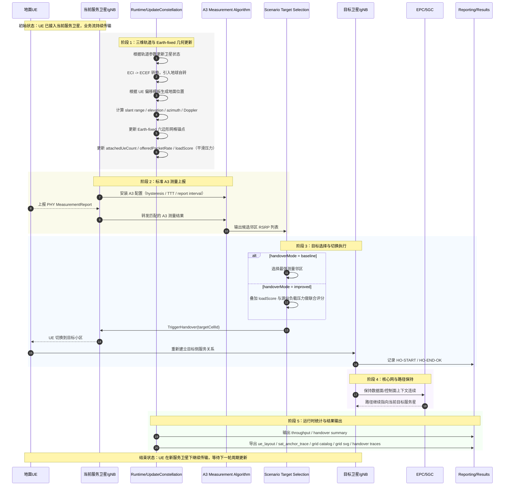
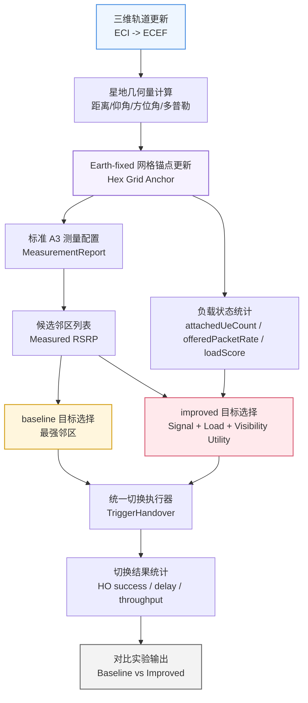

# 毕设中期汇报流程图

本文件保留两张适合中期汇报展示的流程图：
- 图 1：当前统一测量驱动切换主线图
- 图 2：当前 baseline / improved 目标选择分叉图

如果 Markdown 预览支持 `Mermaid`，可以直接查看；如果 `PPT` 不方便嵌入 `Mermaid`，可截图后使用。

## 图 1：当前统一测量驱动切换主线图

图 1 对应当前平台的真实实现，突出以下内容：
- 三维轨道更新与 `ECI -> ECEF`
- `Earth-fixed` 地面六边形网格锚点
- `25 UE` 的 `seven-cell` 二维部署
- `UE` 局部偏移模板到 `WGS84/ECEF` 的统一位置生成
- 标准 `MeasurementReport` 上报与目标选择
- `RRC TriggerHandover`
- 切换统计与结果输出

## 图 2：当前 baseline / improved 目标选择分叉图

图 2 对应当前平台的真实结构，说明 baseline 与 improved 已经在同一测量入口上形成对照。

重点突出：
- 当前平台已经统一的测量入口
- baseline 与 improved 的分叉位置
- 负载项如何只进入 improved，不回写 baseline

## 汇报提示

讲图 1 时：
- 强调这张图对应当前平台的真实实现，而不是照搬地面蜂窝流程
- 突出三维轨道、`Earth-fixed` 网格、标准测量上报与统一切换执行链

讲图 2 时：
- 强调 baseline 与 improved 已经共用同一 `MeasurementReport` 入口
- 重点说明当前平台已有 `loadScore`、`attachedUeCount`、`offeredPacketRate` 等输入，当前差异只发生在目标选择阶段

## 建议标题
- `当前统一测量驱动切换主线图`
- `当前 baseline / improved 目标选择分叉图`
